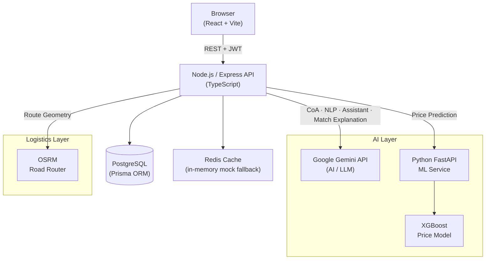

# CarbonBridge

> **An intelligent B2B CO₂ marketplace and transaction platform connecting captured carbon supply with utilization demand.**

CarbonBridge transforms captured industrial CO₂ from a cost burden into a discoverable, procurable, and deliverable resource — connecting emitters and utilization businesses through smart matching, transparent pricing, and optimized logistics.

**HackOut '26 · PS8 — Carbon Capture-to-Product Matchmaking Platform · Team AESTRO**

---

## 🚀 Overview

Industrial CO₂ capture is growing across cement, steel, petrochemical, and power sectors. Yet captured carbon frequently goes to waste — not for lack of demand, but because supply and demand are fragmented, pricing is opaque, logistics are uncoordinated, and verification workflows are manual.

CarbonBridge addresses this end-to-end:

```
Capture → List → Match → Price → Allocate → Optimize → Deliver
```

Sellers register captured CO₂ batches with purity, quantity, and location details, and optionally upload third-party Certificates of Analysis. Buyers post requirements or browse available supply, receive AI-powered matches scored across six factors, and confirm procurement through fixed-price purchase or seller-side auction. Allocated shipments are routed, tracked, and delivered through an economical logistics optimizer backed by OSRM road-network routing.

---

## 🎯 The Problem

| Challenge | Impact |
|---|---|
| **Fragmented supply** | Buyers spend weeks locating and qualifying CO₂ suppliers individually |
| **No transparent pricing** | Both sides negotiate blind without reference points |
| **Multi-supplier fulfillment** | Large requirements can't be met from a single plant |
| **Logistics complexity** | Cryogenic CO₂ transport requires specialized planning |
| **Document integrity** | Certificate of Analysis validation is manual and error-prone |
| **Market discovery** | Emitters have no channel to reach utilization buyers |

Potential utilization sectors include synfuel synthesis, building materials (concrete curing), food & beverage carbonation, greenhouse cultivation, and chemical feedstock — all requiring consistent supply quality and reliable delivery.

---

## 💡 The Solution

CarbonBridge is a full-stack B2B platform built specifically for the captured CO₂ supply chain:

- **Marketplace** — Real-time listings from verified industrial emitters
- **Smart Matching** — 6-factor AI-scored matching including multi-supplier pooling
- **Dual Transaction Models** — Fixed-price purchase and seller-side sealed auctions
- **AI Capabilities** — NLP requirement parsing, CoA intelligence, price prediction, personalized assistant
- **Logistics Optimizer** — Economic route planning with OSRM road geometry and transparent cost breakdown
- **Shipment Tracking** — Full lifecycle from allocation to delivery with estimated in-transit progress
- **Live Map** — Buyer/seller active transaction map with road-based route geometry

---

## ✨ Key Features

### 🏪 Core Marketplace
- Browse CO₂ listings with batch-level detail (purity %, quantity, location, price)
- Post buyer CO₂ requirements with quantity, purity threshold, delivery deadline, and budget
- Seller-controlled pricing — fixed price or auction
- Certificate of Analysis upload and AI analysis per batch
- Batch-level inventory with atomic allocation protection

### 🤖 AI & Intelligence
- **Smart CO₂ Matchmaker** — 6-factor scored matching with multi-supplier composite plans
- **Natural Language Requirement Parser** — English, Hindi, and Hinglish input with Gemini + deterministic fallback
- **AI CoA Intelligence** — Gemini-powered PDF analysis, field extraction, and cross-check against registered batch data
- **AI Price Intelligence** — Rule-based advisory corridor + XGBoost ML prediction (prototype, synthetic-data trained)
- **AI Assistant** — Role-aware conversational guide for buyers and sellers (read-only, no autonomous transactions)
- **Voice Input** — Browser Web Speech API for natural language requirement dictation

### 💼 Procurement & Transactions
- Fixed-price direct purchase
- Seller-side auctions with configurable closing time
- Buyer bids on active auction listings
- Seller reviews and finalizes auction winner
- Atomic inventory deduction prevents over-allocation
- Concurrency-safe batch allocation (verified by dedicated concurrency tests)

### 🚚 Logistics & Delivery
- Smart Transportation Cost Optimizer: single-seller to one or multiple buyers
- Transparent cost breakdown: fuel, operating, driver/crew, estimated tolls, loading, unloading
- OSRM road-network routing with actual drivable geometry (automatic fallback to straight-line if OSRM unavailable — never mislabeled as road route)
- Vehicle capacity constraints with automatic multi-trip planning
- Delivery window feasibility checking
- Estimated in-transit shipment progress (geometry interpolation based on timing and route — not GPS)
- Shipment lifecycle: `ALLOCATED → DISPATCH_PENDING → IN_TRANSIT → DELIVERED → RECEIVED`

### 🔐 Trust & Data Integrity
- Batch-level CO₂ inventory tracking
- Third-party Certificate of Analysis upload per batch
- AI extraction flags discrepancies between CoA data and registered batch parameters
- Atomic database transactions prevent inventory overselling
- Role-based access control (BUYER / SELLER / ADMIN)
- Tenant isolation — buyers and sellers access only their own data

---

## 🤖 AI Capabilities

### AI Smart CO₂ Matchmaker

The matchmaker evaluates every available listing against a buyer requirement across **6 scored factors**:

| Factor | What It Evaluates |
|---|---|
| **Quantity Fit** | How well available quantity covers the required volume |
| **Purity Fit** | Whether CO₂ purity meets or exceeds the minimum threshold |
| **Price Competitiveness** | Landed cost versus buyer's stated budget |
| **Distance Efficiency** | Geographic proximity between seller plant and buyer destination |
| **Availability** | Delivery timeline feasibility against required date |
| **Delivery Feasibility** | Estimated transit hours vs. deadline (FEASIBLE / TIGHT / UNLIKELY) |

Each factor produces a `score / maxScore` with a rating (`Excellent`, `Good`, `Moderate`, `Fair`) and a plain-English explanation. The composite score ranks matches.

**Multi-supplier pooling** is generated automatically when no single supplier can fulfill the full requirement — e.g., a 500T requirement pooled from a 100T + 200T + 200T combination, with per-lot landed costs and total cost computed transparently.

Match explanations (the "Why this match" narrative) are generated using Gemini. The underlying scoring is deterministic — Gemini provides language, not the match decision.

---

### AI Price Intelligence

Two complementary price signals are provided to sellers when pricing a listing:

**1. Rule-Based Advisory Price Corridor** — A deterministic range (`recommendedLowerPrice` to `recommendedUpperPrice`) computed from:
- Base industrial benchmark (INR 2,200–2,500/T)
- Purity premium (+INR 30/T per point above 80%) or discount (−INR 20/T below 70%)
- Volume tier discount (4% at 200T+, 8% at 500T+)
- Live supply/demand imbalance adjustment from actual marketplace data

**2. XGBoost ML Price Prediction** — A Python FastAPI microservice serving a trained XGBoost regressor.

> ⚠️ **Prototype Disclosure**: The XGBoost model is trained on **synthetically generated** transaction data designed to reflect realistic CCUS market physics (purity premiums, volume discounts, supply-demand dynamics, application willingness-to-pay). Predictions are suitable for system demonstration and validation — not real-world market pricing. The synthetic data generator is openly included in `ml-service/training/train.py`.

**XGBoost Feature Set:**

| Feature | Description |
|---|---|
| `purity` | CO₂ purity percentage |
| `quantityTonnes` | Batch size |
| `distanceKm` | Distance to buyer location |
| `demandIndex` | Relative demand signal |
| `supplyIndex` | Relative supply signal |
| `auctionAveragePrice` | Recent auction clearing price context |
| `intendedUse_encoded` | Application category (SYNFUEL, CONSTRUCTION, etc.) |

Sellers retain full pricing control — the corridor and ML prediction are advisory only.

---

### Natural Language Requirement Parsing

Buyers can express CO₂ requirements in plain language — in English, Hindi, or Hinglish. The parser uses Gemini with a deterministic regex/city-alias fallback.

**Example input:**
```
Mujhe Rajkot mein 300 tonne CO₂ chahiye, minimum purity 90%,
budget ₹2500 per tonne, delivery 30 September 2026 tak.
```

**Extracted fields:**
```json
{
  "quantityTonnes": 300,
  "minimumPurity": 90,
  "city": "Rajkot",
  "state": "Gujarat",
  "maxPricePerTonne": 2500,
  "requiredDate": "2026-09-30",
  "intendedUse": null
}
```

Supported cities span Gujarat, Maharashtra, Delhi, Rajasthan, Karnataka, Tamil Nadu, and more (20 cities with alias resolution — e.g., "Bangalore" → "Bengaluru"). When Gemini is unavailable, the system falls back to deterministic regex extraction. Vague timelines like "next month" return `null` rather than fabricating a date.

Voice input via the browser Web Speech API is integrated into the requirement form — spoken input is transcribed directly into the natural language field.

---

### AI CoA Intelligence

When a seller uploads a Certificate of Analysis PDF for a CO₂ batch, CarbonBridge analyzes it using Gemini:

```
Seller uploads CoA PDF
         ↓
Gemini analyzes document
         ↓
Extracts structured parameters
         ↓
Purity · Moisture · CO₂ Concentration · Test Date ·
Batch Reference · Laboratory Name · Contaminants
         ↓
Cross-checks extracted values against registered batch data
         ↓
Flags discrepancies for review
```

Results are labeled `AI Analyzed` / `AI Extracted` — not laboratory-verified. Discrepancies (e.g., extracted purity differs significantly from registered purity) are surfaced as warnings. The extraction includes retry logic, concurrent execution guards, and Gemini model failover. Results are stored in PostgreSQL and visible on the batch detail page.

---

### AI Assistant

A role-aware conversational guide powered by Gemini with a 30-minute sliding session history (max 6 turns retained):

- **Buyers** receive guidance on posting requirements, interpreting match scores, understanding auction mechanics, and tracking shipments
- **Sellers** receive guidance on listing batches, uploading CoAs, setting prices, running auctions, and logistics planning
- Context-aware: for personal insight queries, the assistant fetches the user's own transaction/batch data (scoped by JWT role)
- **Read-only** — the assistant provides information and navigation guidance; it does not execute transactions autonomously

---

## 🚚 Smart Logistics

### Transportation Cost Optimizer

Plans economical delivery routes from a single seller plant to one or multiple buyers. Optimization prioritizes **lowest total economic cost** — not shortest distance.

**Transparent cost breakdown per route:**

| Cost Component | Basis |
|---|---|
| Fuel | Distance ÷ vehicle mileage × fuel price |
| Vehicle operating | Distance × operating rate |
| Driver & hazmat crew | Duration × hourly rate |
| Estimated tolls | Distance × configured toll rate estimate |
| Loading | Quantity × per-tonne rate |
| Unloading | Stops × per-stop rate |

All rates are configurable via environment variables. Toll rates are estimated from configured assumptions — not real-time external data.

**Multi-buyer routing:** When a seller has multiple active shipments, the optimizer evaluates delivery sequences and recommends the lowest-cost order. Vehicle capacity constraints trigger automatic multi-trip planning (e.g., 350T demand with a 200T vehicle = 2 trips, each with its own route and cost).

### Road Network Routing · OSRM

OSRM (Open Source Routing Machine) provides actual drivable road geometry, route distance, and duration. The system:
- Queries OSRM for each seller → buyer leg
- Returns GeoJSON `LineString` geometry for map display
- Gracefully falls back to straight-line visualization if OSRM is unavailable — **never mislabeled as a road route** (`routeType: "FALLBACK_DIRECT"`)

### Shipment Progress Estimation

For `IN_TRANSIT` shipments, the system estimates current truck position by interpolating along the OSRM route geometry using dispatch timestamp and estimated transit duration.

> ⚠️ This is estimated progress based on route geometry and timing — **not live GPS tracking**. No GPS or IoT integration is implemented.

---

## 🔄 End-to-End Workflow

### Buyer Journey
1. Register and set delivery location
2. Browse marketplace listings or post a CO₂ requirement
3. Use natural language input (typed or voice) for requirement
4. View AI-scored matches ranked by composite score
5. Review multi-supplier composite plans if applicable
6. Select fixed-price purchase or place bid on auction
7. Seller confirms / auction closes → order allocated
8. Monitor shipment on Active Transaction Map
9. Confirm receipt to complete delivery

### Seller Journey
1. Register company and plant location
2. Register CO₂ batch (purity, quantity, storage details)
3. Upload Certificate of Analysis (optional — triggers AI analysis)
4. Create listing: fixed-price or auction with closing time
5. View AI price advisory corridor and ML prediction
6. Receive buyer interest (direct purchase or auction bid)
7. Finalize auction winner
8. Review logistics optimizer for active shipments
9. Dispatch → update shipment status → delivery complete

---

## 🏗️ Architecture



**Backend modules:** `auth` · `batches` · `listings` · `requirements` · `matching` · `pricing` · `orders` · `auctions` · `shipments` · `logistics` (cost, route, optimizer) · `maps` · `ai` (matchmaker, CoA, parser, assistant) · `insights` · `notifications` · `documents` · `audit`

---

## 🛠️ Technology Stack

| Layer | Technology |
|---|---|
| **Frontend** | React 18, Vite, React Router, Leaflet (maps), CSS |
| **Backend** | Node.js, Express, TypeScript |
| **Database** | PostgreSQL 16 |
| **ORM** | Prisma 5 |
| **Cache** | Redis (ioredis) with in-memory mock fallback |
| **AI / LLM** | Google Gemini API (`gemini-2.0-flash`) |
| **ML Service** | Python 3, FastAPI, XGBoost, scikit-learn, pandas |
| **Maps** | Leaflet.js |
| **Road Routing** | OSRM (Open Source Routing Machine) |
| **Auth** | JWT (access + refresh tokens) |
| **Validation** | Zod |
| **Logging** | Pino + pino-pretty |
| **Security** | Helmet, CORS, express-rate-limit |
| **Testing** | Vitest, Supertest |
| **Containerization** | Docker, Docker Compose |

---

## 🔐 Security

- **JWT authentication** with short-lived access tokens (15 min) and 7-day refresh tokens
- **Role-based access control** — BUYER, SELLER, ADMIN roles enforced at route and service level
- **Tenant isolation** — all data queries scoped to authenticated company ID via JWT
- **Input validation** with Zod schemas on all API endpoints
- **Atomic allocation** — Prisma transactions prevent batch over-allocation under concurrent requests
- **Helmet** — HTTP security headers
- **CORS** — Origin restriction configurable via environment variable
- **Rate limiting** — express-rate-limit on sensitive endpoints
- **Gemini API key** — server-side only, never exposed to the frontend
- **File upload** — CoA PDFs stored server-side; authenticated download only

> Security-conscious architecture suitable for a prototype B2B platform. Not independently audited for production enterprise deployment.

---

## 📊 Test Results

**315 tests across 31 test files — all passing.**

```
Test Files  31 passed (31)
     Tests  315 passed (315)
  Duration  ~132s
```

**Test coverage spans:**

| Area | Tests |
|---|---|
| Buyer transactions & auction bidding | Integration |
| Concurrent allocation protection | Stress / concurrency |
| AI matchmaker & 7-factor scoring | Integration |
| NLP requirement parsing (EN/HI/Hinglish) | Integration |
| AI CoA intelligence & security | Integration |
| Smart transport optimizer (unit + integration) | Unit + Integration |
| Logistics cost consistency & multi-trip | Unit |
| Shipment estimated progress & geometry | Unit + Integration |
| Active transaction map & tenant isolation | Integration |
| ML price prediction API | Integration |
| AI Assistant API | Integration |
| Core REST API | Integration |
| State machine transitions | Unit |
| Purity/geo/pricing logic | Unit |

---

## ⚙️ Local Setup

### Prerequisites

| Requirement | Version |
|---|---|
| Node.js | 20+ |
| npm | 10+ |
| PostgreSQL | 15+ |
| Python | 3.11+ |
| Redis | 7+ *(optional — mock fallback included)* |
| OSRM | Public instance or self-hosted *(optional — straight-line fallback)* |

---

### 1. Clone

```bash
git clone https://github.com/zuhebkhan011/CARBONBRIDGE.git
cd CARBONBRIDGE
```

### 2. Environment Variables

```bash
cp .env.example .env
# Edit .env — at minimum set DATABASE_URL and GEMINI_API_KEY
```

### 3. Install Dependencies

```bash
# Backend
npm install

# Frontend
cd frontend && npm install && cd ..
```

### 4. Database

```bash
# Generate Prisma client
npm run prisma:generate

# Run migrations
npm run prisma:migrate

# Seed demo data (sellers, buyers, batches, listings)
npm run prisma:seed
```

### 5. ML Service

```bash
cd ml-service
python -m venv .venv
# Windows:
.venv\Scripts\activate
# macOS/Linux:
source .venv/bin/activate

pip install -r requirements.txt

# Train the XGBoost model (required before starting the ML service)
python training/train.py

# Start the FastAPI ML service
uvicorn app.main:app --host 0.0.0.0 --port 8000
cd ..
```

### 6. Start Services

```bash
# Terminal 1 — Backend API
npm run dev

# Terminal 2 — Frontend
cd frontend && npm run dev

# Terminal 3 — ML Service (if not already running)
cd ml-service && uvicorn app.main:app --host 0.0.0.0 --port 8000
```

| Service | URL |
|---|---|
| Frontend | http://localhost:5173 |
| Backend API | http://localhost:4000 |
| Swagger / API Docs | http://localhost:4000/api/docs |
| ML Service | http://localhost:8000 |
| Health Check | http://localhost:4000/health |

---

### Docker (Alternative)

```bash
cp .env.example .env
# Set GEMINI_API_KEY in .env

docker compose up --build
```

> Note: The Docker Compose setup runs PostgreSQL, Redis, Backend, and ML service. The frontend runs separately with `npm run dev` from the `frontend/` directory.

---

## 🔑 Environment Variables

| Variable | Required | Description |
|---|---|---|
| `PORT` | No | Backend server port (default: 4000) |
| `NODE_ENV` | No | `development` or `production` |
| `DATABASE_URL` | **Yes** | PostgreSQL connection string |
| `REDIS_URL` | No | Redis URL — falls back to in-memory mock |
| `JWT_SECRET` | **Yes** | Access token signing secret (32+ chars) |
| `JWT_EXPIRES_IN` | No | Access token TTL (default: `15m`) |
| `JWT_REFRESH_SECRET` | **Yes** | Refresh token signing secret |
| `JWT_REFRESH_EXPIRES_IN` | No | Refresh token TTL (default: `7d`) |
| `CORS_ORIGIN` | **Yes** | Allowed frontend origin |
| `UPLOAD_MAX_FILE_SIZE_MB` | No | CoA upload size limit (default: `10`) |
| `ML_SERVICE_URL` | No | ML FastAPI URL (default: `http://localhost:8000`) |
| `GEMINI_API_KEY` | **Yes*** | Google Gemini API key — required for AI features |
| `GEMINI_MODEL` | No | Gemini model name (default: `gemini-2.0-flash`) |
| `CRYO_FREIGHT_BASE_RATE_PER_KM` | No | Freight rate estimate (default: `1.85` INR/km/T) |
| `CRYO_TRANSIT_ESTIMATE_KM_PER_HOUR` | No | Transit speed estimate (default: `45` km/h) |

*\*Without a Gemini key, AI features (CoA extraction, NLP parsing, match explanations, assistant) gracefully degrade or skip.*

---

## 🧪 Testing

```bash
# Run all tests (backend)
npm test

# Watch mode
npm run test:watch

# Concurrency-specific tests
npm run test:concurrency
```

```bash
# Frontend build validation
cd frontend && npm run build
```

```bash
# Backend TypeScript compilation
npm run build
```

---

## 🎬 Recommended Demo Flow

For hackathon judges evaluating CarbonBridge:

1. **Register** as a Seller → add company details and plant location
2. **Register a CO₂ batch** with purity 78%, quantity 150T
3. **Upload a Certificate of Analysis** PDF → trigger AI CoA extraction
4. **Create a listing** → view the advisory price corridor and ML price prediction
5. **Register** as a Buyer (separate account)
6. **Post a requirement** using the natural-language input field (English or Hinglish)
7. **Run AI matching** → inspect 6-factor scores and match explanations
8. **Observe multi-supplier pooling** for large requirement volumes
9. **Place a fixed-price purchase** → watch inventory atomically deduct
10. **Switch to Logistics tab** (as Seller) → open the transport optimizer
11. **Review route** — OSRM geometry, cost breakdown (fuel, driver, toll, etc.)
12. **Update shipment to IN_TRANSIT**
13. **Open Active Transaction Map** (as Buyer) → see road-geometry route and estimated truck position
14. **Complete delivery** → confirm receipt → route disappears from active map

---

## 🏆 Why CarbonBridge?

CarbonBridge is not a chatbot wrapper, not a simple CRUD marketplace, and not a price calculator. It is a full transaction-oriented platform covering:

```
CO₂ Supply Registration
    + Batch-Level Inventory & CoA Integrity
    + AI-Scored Demand Matching (single & multi-supplier)
    + Transparent Pricing Intelligence (rule-based + ML)
    + Dual Procurement Models (fixed-price + auction)
    + Atomic Allocation Protection (concurrency-safe)
    + Economic Logistics Optimization (road-network routing)
    + Shipment Lifecycle Tracking
    + Live Transaction Map
    + Role-Aware AI Assistant
```

Every layer works together: a buyer requirement triggers scoring, scoring informs allocation, allocation triggers logistics planning, logistics produces route geometry, geometry drives the live map, and the full cycle is queryable by the AI assistant — all within a single authenticated session.

---

## 🌱 Intended Impact

- Give industrial CO₂ emitters a channel to monetize captured carbon instead of venting or storing at cost
- Give utilization businesses (synfuel, construction, food, greenhouses) a unified discovery and procurement interface
- Reduce sourcing friction through transparent matching and pricing
- Enable smarter logistics through route consolidation and economic optimization
- Turn captured CO₂ from a compliance cost center into a tradable industrial resource

Impact claims are qualitative; no real-world market deployment or measured environmental data exists at this stage.

---

## ⚠️ Prototype Limitations

Being transparent about limitations is part of building credibility:

| Limitation | Detail |
|---|---|
| **ML pricing** | XGBoost model trained on **synthetic data** — not real transaction history |
| **Logistics cost rates** | Fuel, toll, operating rates are **configured estimates** — not live external data |
| **Shipment progress** | Estimated via geometry interpolation — **not live GPS / IoT tracking** |
| **OSRM availability** | Road routing requires a running OSRM instance — falls back to straight-line visualization |
| **CoA intelligence** | AI extraction and cross-check — **not laboratory verification** |
| **Gemini dependency** | AI features require a valid Gemini API key — platform core works without it |
| **Redis** | Falls back to in-memory mock — **not suitable for multi-instance deployment** without a real Redis instance |
| **Scale** | Prototype-grade infrastructure — not load-tested for production throughput |

---

## 🚀 Future Roadmap

> These are planned future directions — **not implemented features**.

- Real CCUS market transaction datasets for ML model training
- Live GPS / IoT integration for real-time shipment tracking
- Verified digital CoA workflows with accredited laboratory integration
- Demand forecasting for CO₂ supply planning
- Logistics partner API integrations (actual freight carriers)
- Payment and settlement integration
- Regulatory and carbon accounting workflow support
- Enterprise procurement features (contract pricing, SLAs)
- Mobile application

---

## 👥 Team

**AESTRO** — HackOut '26

---

## 🏁 Hackathon Context

**HackOut '26 · Problem Statement 8 — Carbon Capture-to-Product Matchmaking Platform**

PS8 challenges participants to build a platform that connects industrial carbon capture sources with product manufacturers who can utilize CO₂ as a raw material.

CarbonBridge addresses all core dimensions of PS8:

- ✅ CO₂ supply discovery and listing
- ✅ Demand-side buyer requirements
- ✅ Intelligent supply-demand matching
- ✅ Pricing guidance and ML prediction
- ✅ Transaction workflow (purchase + auction)
- ✅ Logistics and delivery planning
- ✅ Document integrity (CoA)
- ✅ AI-augmented workflows throughout

---

## 📜 License

This project was built for HackOut '26. No license has been explicitly applied at this stage.

---

*Built with ❤️ for HackOut '26 · Team AESTRO*
